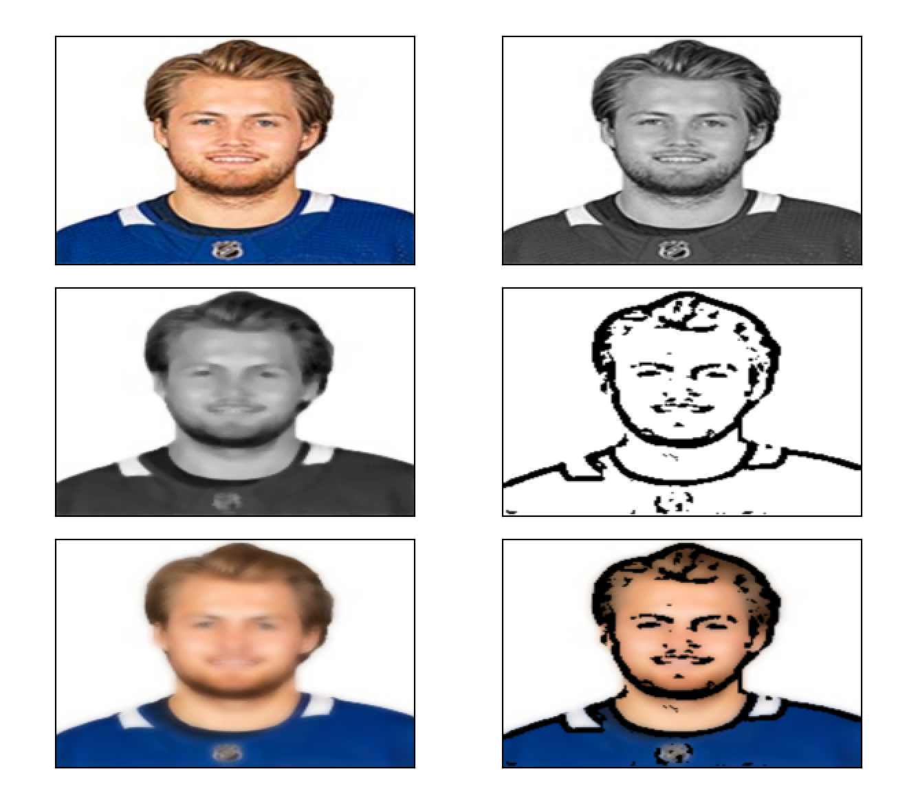

# Toon

###### Welcome to **Toon** the photo cartoonifyer! 💥Turn any image into cartoon form!

The aim is to transform images into its cartoon.

---

This is my first project using [OpenCV](https://docs.opencv.org/4.x/d1/dfb/intro.html) and Python in unision 😎

* My first attempt at a Computer Vision type project 🤯

## Setup

Import Libaries:

> CV2, easygui, Numpy, Imageio, Matplotlib and OS

So you must use (form these libaries):

> pip install ...

---

Sample image:

 (nylander.jpg)

The application will display:

---

##### After this is displayed the user has the option to save any one they want!
